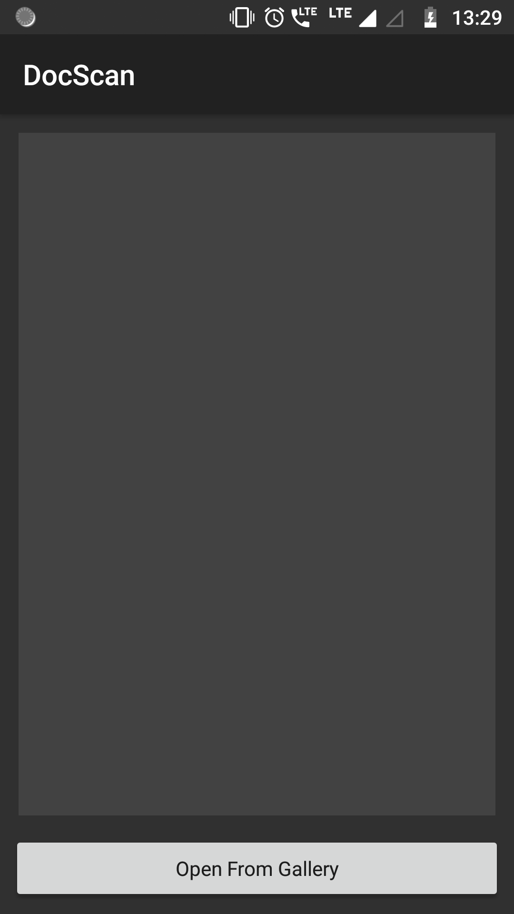
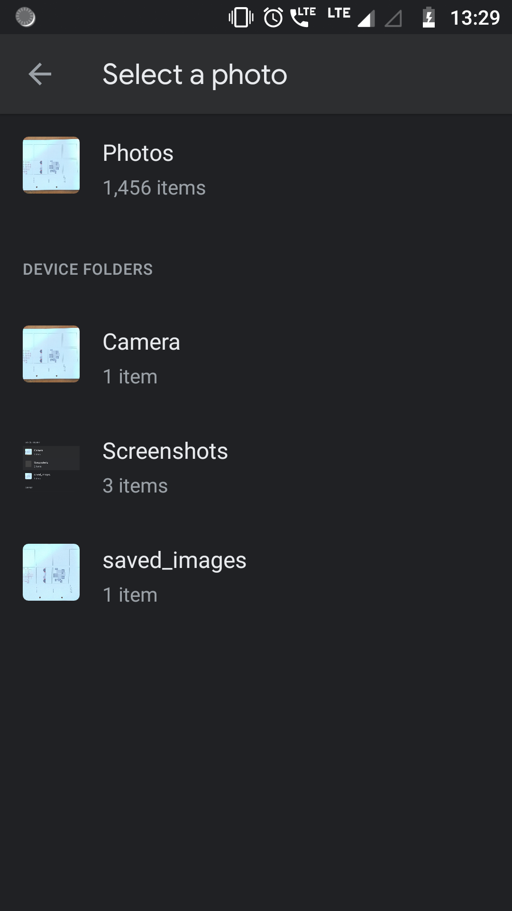
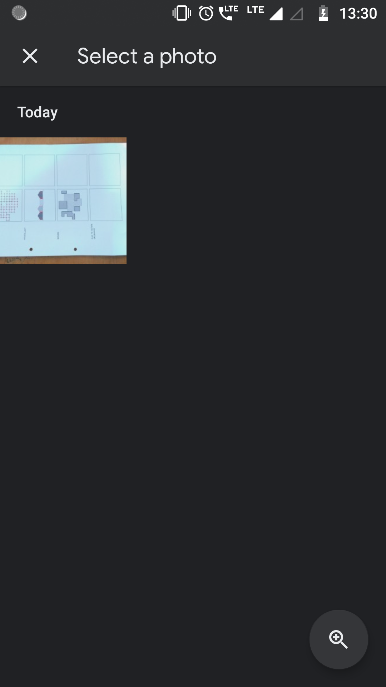
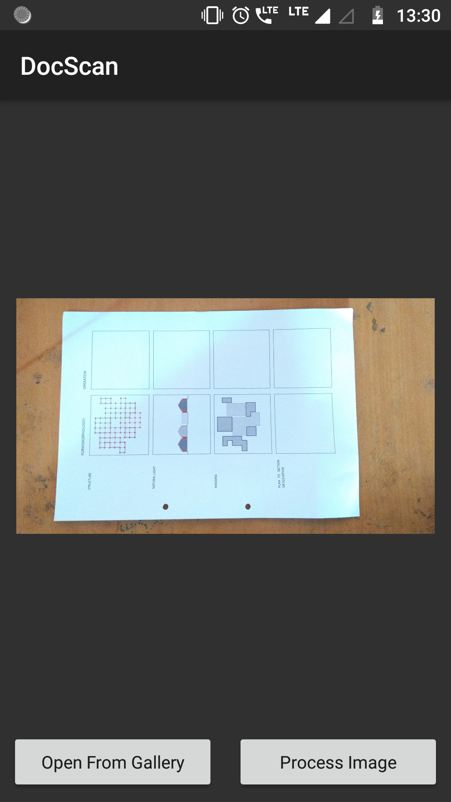
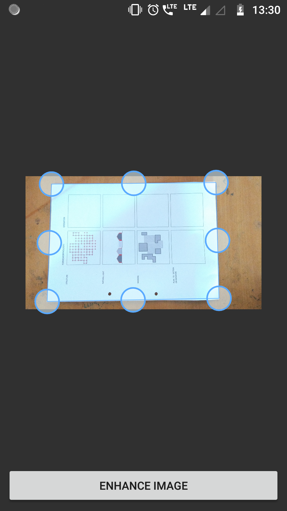
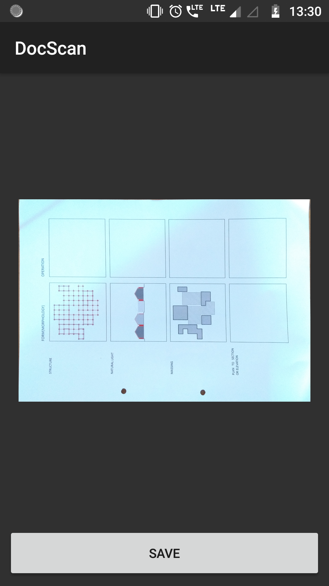
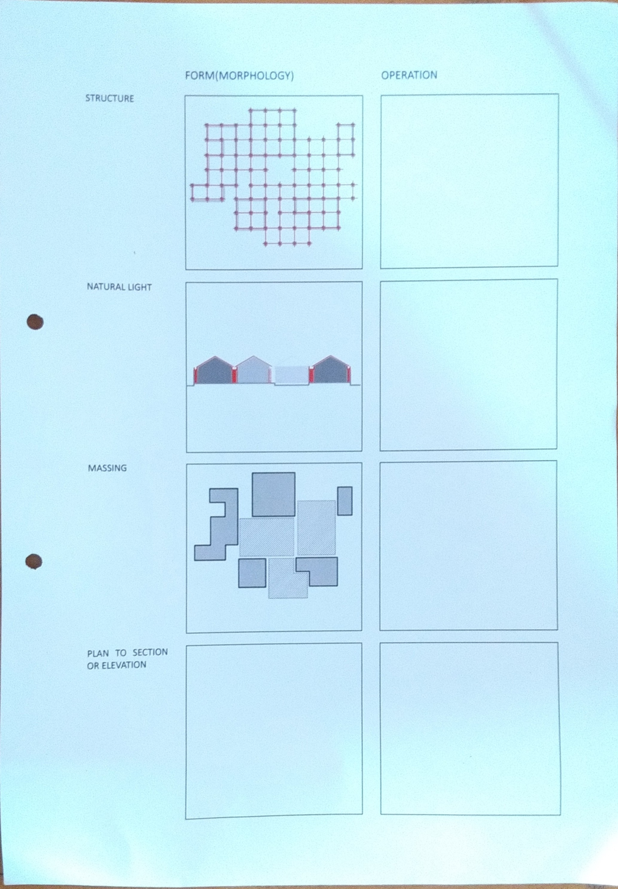

# DocScan
Simple Documnet Scanner built using openCV for Android
Steps to follow:
1) click or select an image
2) use the predefined boundaries or set boundaries by yourself
3) Voila!! Get Scanned Copy of your photo

# App Design

       

  

# Output

